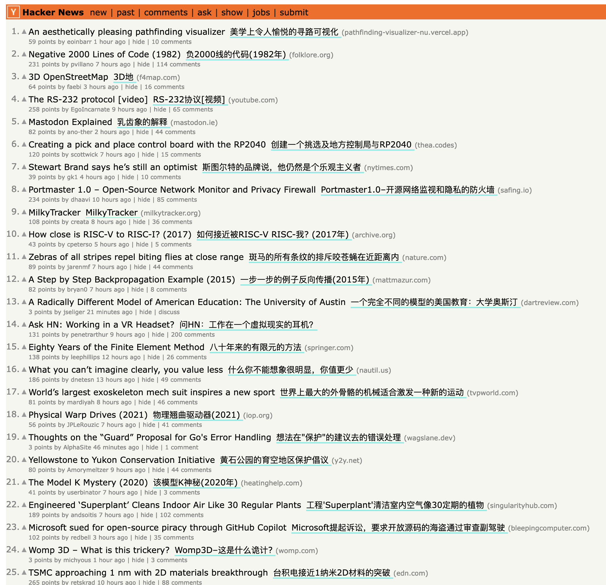
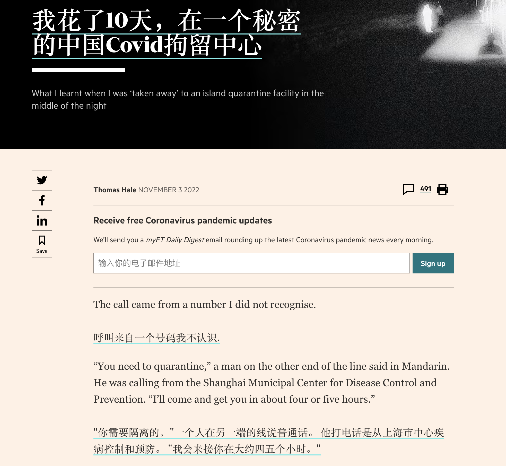

#  Translate Web Pages

Translate your page in real time using Google or Yandex.

说明： 这是我修改的体验增强版，支持双语显示，支持只翻译网页里的文章区域。本来是验证下概念，但是收到了不少关注，所以我最近会完善下相关功能，多多测试后，看下[上游](https://github.com/FilipePS/Traduzir-paginas-web)作者是否愿意合并, 如果这个方向不是上游作者乐见的，那么我会单独发布到商店里。

目前已适配：

- Twitter
- Reddit,(包括old.reddit.com)
- Hacker News
- 其他大多数强内容网站

正在适配：

- Youtube 评论区

目前的版本还没准备好发布到商店，但是欢迎[下载体验](https://github.com/theowenyoung/Traduzir-paginas-web/releases/tag/v0.0.2),你需要在浏览器中手动安装：

1. 在[这里](https://github.com/theowenyoung/Traduzir-paginas-web/releases/tag/v0.0.1)下载对应浏览器的压缩包，chrome或firefox
2. 解压到以后不删除的文件夹

如果是谷歌浏览器：

3. 打开扩展管理窗口
4. 激活开发者模式
5. 选择 "Load unpacked",选择刚解压的文件夹
6. 安装后，target语言可以选中文，然后再翻译页面即可有双语显示（现在还没有任何选项可以设置）

火狐浏览器

3. 打开`about:debugging`页面
4. 点击火狐图标
5. 加载临时扩展，直接选中压缩包即可
6. 安装后，target语言可以选中文，然后再翻译页面即可有双语显示（现在还没有任何选项可以设置）

---

## Install

#### Firefox
- Desktop users, download from [Mozilla Addons](https://addons.mozilla.org/firefox/addon/traduzir-paginas-web/).
- Mobile users, see [this tutorial](https://www.ghacks.net/2020/10/01/you-can-now-install-any-add-on-in-firefox-nightly-for-android-but-it-is-complicated/).

#### Chromium based browsers

1. Download [this file](https://github.com/FilipePS/Traduzir-paginas-web/releases/download/v9.6/TWP.9.6.Chromium.zip), or any [other version](https://github.com/FilipePS/Traduzir-paginas-web/releases)
2. Extract the zip file
3. Open your browser's extension manager
4. Activate developer mode
5. Load the extension with the option "Load unpacked"
- Note: You can also install via [crx file](https://github.com/FilipePS/Traduzir-paginas-web/releases/download/v9.6/TWP.9.6.crx), download the file using a download manager/or firefox. Activate developer mode and drag the file into the chromium extension manager. It doesn't work on Chrome/Edge.

## Screenshots
| Menu 1 | Menu 2 | Translated |
| :--: | :--: | :--: |
|  |  |  |

## Contribute

- To collaborate with the translation of the extension interface use [Crowdin](https://crowdin.com/project/translate-web-pages).

## Donations

To make a donation use [Patreon](https://www.patreon.com/filipeps).

## FAQ

**What can this extension do?**

Your current page is translated without having to open new tabs.
It is possible to change the translation language.
You can select to automatically translate.
To change the translation engine just touch the Google Translate icon. 

**Why do you need to access your data on all the websites you visit?**

To translate any website it is necessary to access and modify the text of the web pages. And the extension can only do that, with that permission.

**How are the pages translated?**

The pages are translated using the Google or Yandex translation engine (you choose).

**And how's my privacy?**

[Privacy policy](https://addons.mozilla.org/addon/traduzir-paginas-web/privacy/): We do not collect any information. However, to translate, the contents of the web pages will be sent to Google or Yandex servers.

**Limitations**

Some pages like [support.mozilla.org](https://support.mozilla.org/) and [addons.mozilla.org](http://addons.mozilla.org/) will not be translated. For security reasons, the browser blocks extensions from accessing these sites.
