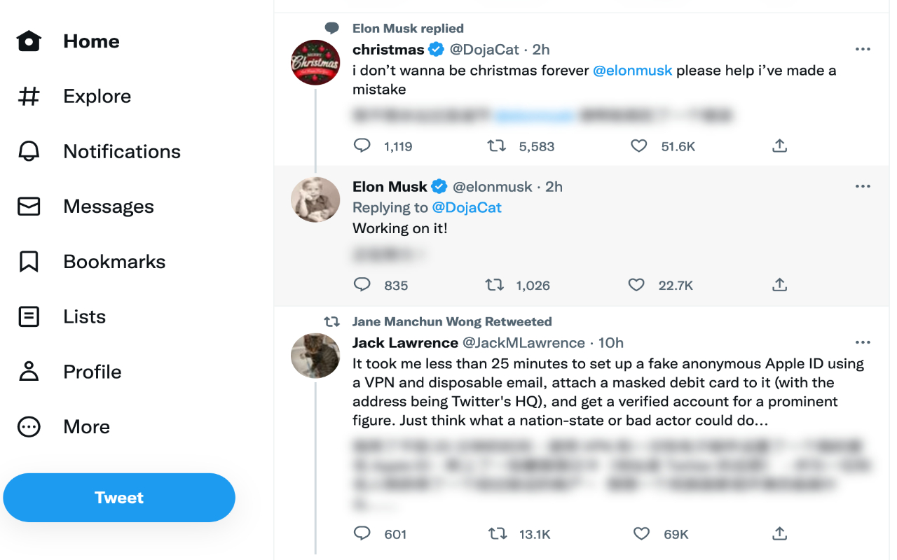
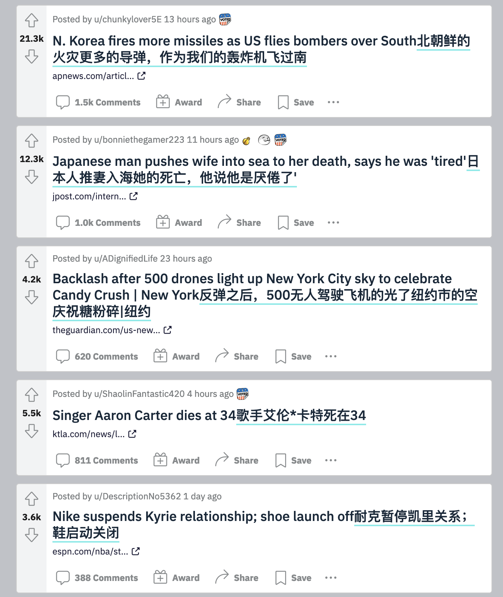
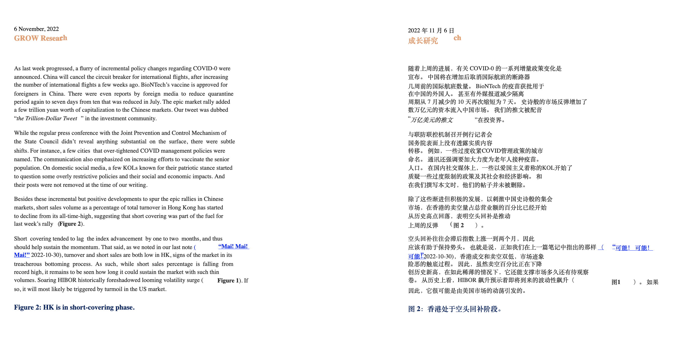
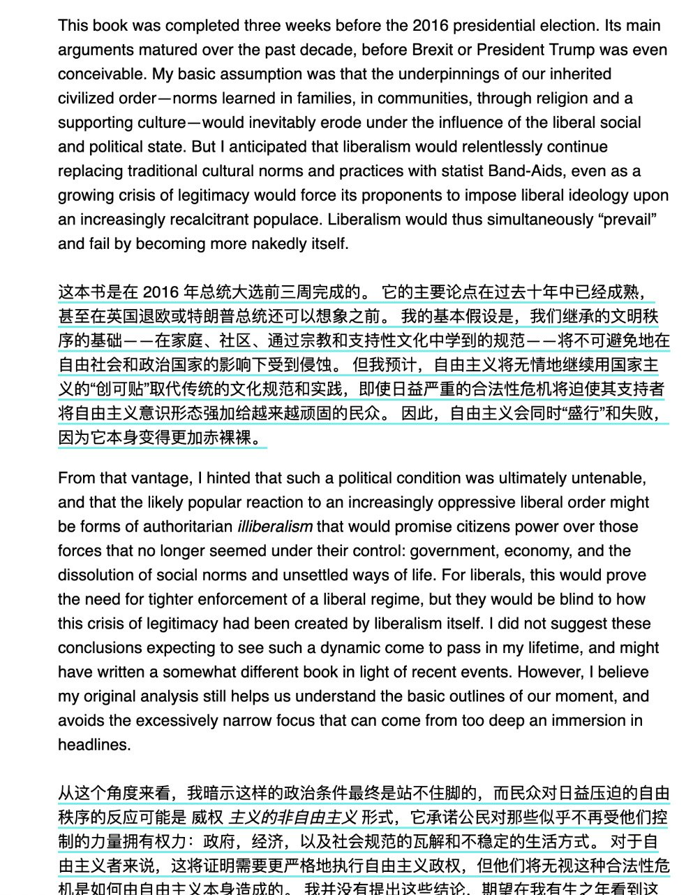
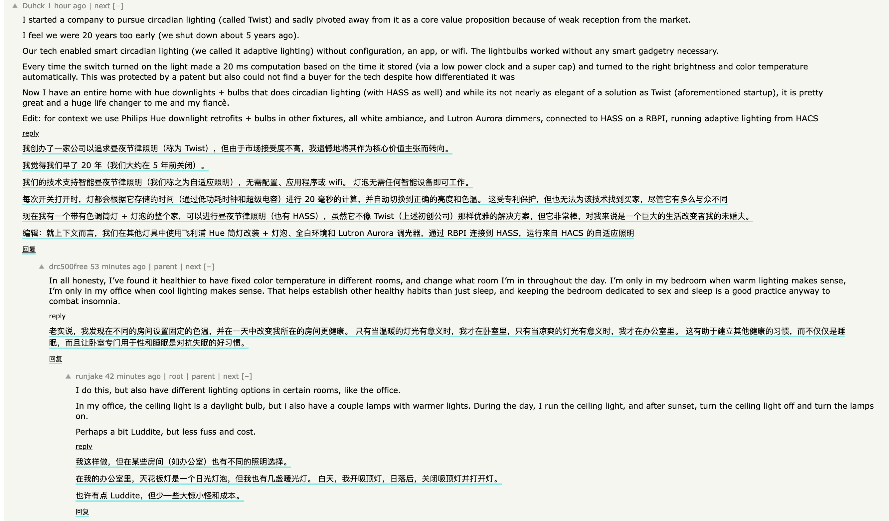

# Immersive Translate - 沉浸式翻译扩展(双语对照）


说明：新版的沉浸式翻译扩展已经迁移到[这里](https://github.com/immersive-translate/immersive-translate)，新版全新架构，性能更好，支持更多的翻译引擎和浏览器平台（包括iOS Safari），以及拥有更好的pdf翻译体验，欢迎移步[新版](https://github.com/immersive-translate/immersive-translate)。旧版代码将存档。

以下为原简介：

---

Let's experience immersive web translation, with bilingual simultaneous display and translation of only the important content. Think of the browser's reading mode, but in immersive translation.

[](https://github.com/immersive-translate/releases)
[](https://github.com/immersive-translate/immersive-translate/latest)
[](https://github.com/immersive-translate/immersive-translate/issues)
[](https://github.com/immersive-translate/immersive-translate/blob/master/LICENSE)

说明： 该扩展Fork自[TWP](https://github.com/FilipePS/Traduzir-paginas-web)扩展，我为其添加了以下功能：

- 双语显示，按照段落分割
- 只翻译网页里的内容区域，而不是把网页中的所有元素都翻译，这极大的增强了翻译后的网页阅读体验。类似浏览器的阅读模式，所以该扩展被重新命名为“沉浸式翻译”
- 为常用网站做了定制优化，比如Twitter，Reddit，Discord, Telegram, Youtube, Hacker News等。我希望这个扩展足够通用，不需要为绝大多数网站做定制，但是往往有一些网站由于不规范，或者非内容类网站，这些网站在单独优化后体验更好，所以我们会对这类网站做单独适配，同时坏处就是可能随时因网站的更新而失效，所以这里我会持续优化。如果有常用的网站翻译显示不佳，欢迎在[Isuee](https://github.com/immersive-translate/immersive-translate/issues)或[Telegram群组](https://t.me/+rq848Z09nehlOTgx)中提出。
- 支持PDF文件双语对照翻译（pdf文件翻译需要点击浏览器右上角的该扩展图标，弹出提示框后按提示框操作）
- 配合epub在线阅读网站<https://1paragraph.app/> 即可实现双语阅读国外电子书

> 已删除原扩展选中文本翻译功能，此扩展现在仅 Focus 网页翻译。划词翻译功能请使用其他同类产品～ 比如 [沙拉查词](https://saladict.crimx.com/),[欧路词典](https://www.eudic.net/v4/en/app/eudic)

**视频介绍**

[](https://www.youtube.com/watch?v=9TzX0xEBmyw)


沉浸式翻译和[原扩展](https://github.com/FilipePS/Traduzir-paginas-web)的目标不太一样，原扩展的目标是成为一个非常通用的翻译扩展，是浏览器自带翻译的良好替代品。
但是此扩展更关注的用户群体是经常需要看外文的用户，希望能帮助这些群体在阅读外文页面时有一个更好的体验（我想做这个扩展就是因为我经常需要在[Buzzing](https://www.buzzing.cc/)上浏览大量的外媒文章），所以该扩展的目标群体是：

- 经常阅读国外长篇文章，论文
- 阅读外文PDF，外语电子书
- 希望快速浏览Twitter，Reddit，Hacker News，Telegram, Discord, Github 等国外论坛网站
- 希望同时显示双语来学习目标语言
- 希望同时显示双语，以平衡部分机器翻译的不知所云
- 希望尽快摆脱这个扩展，直接习惯看原文的用户的过渡助手

该扩展同时支持（依赖）谷歌翻译引擎或Yandex翻译引擎，完全免费，希望我们都能尽可能平等的获取知识，不要让语言成为障碍，感谢[原作者](https://github.com/FilipePS/Traduzir-paginas-web)为这个项目付出的巨大努力。

本项目的[Wiki页面](https://github.com/immersive-translate/immersive-translate/wiki)下有更多使用帮助信息。

## 安装说明

### Firefox 

已发布到商店，可以[直接下载](https://addons.mozilla.org/en-US/firefox/addon/immersive-translate/)。如果你想最快体验到新版，也可以直接在[Release页面](https://github.com/immersive-translate/immersive-translate/releases)下载最新构建的版本，已签名，可以直接安装。

### Chrome/Edge


Chrome/Edge商店均已上架，可以直接下载

- [Chrome商店地址](https://chrome.google.com/webstore/detail/immersive-translate/bpoadfkcbjbfhfodiogcnhhhpibjhbnh)
- [Edge商店地址](https://microsoftedge.microsoft.com/addons/detail/immersive-translate/amkbmndfnliijdhojkpoglbnaaahippg)

### Chrome 手动安装

Chrome商店审核会有延迟，如果你想最快体验新版，可以直接在[Release页面](https://github.com/immersive-translate/immersive-translate/releases)下载最新的版本：

1. 在[这里](https://github.com/immersive-translate/immersive-translate/releases)下载chrome的压缩包
2. 解压到一个以后不会删除的文件夹
3. 打开扩展管理窗口，`chrome://extensions`
4. 激活开发者模式
5. 载入刚解压的扩展文件夹
6. 安装后，target语言选中文（你的母语）
7. 接下来可以设置为“always自动翻译英文”，或者右键手动点击“翻译本页面”，即可有双语显示，打开推特试试看！


除了下载Release页面构建好的版本之外，你还可以通过Clone本项目，然后随着本项目的更新，每次都`git pull`最新代码，然后在本地手动构建: `npm run build`, 然后在扩展管理窗口，里加载 `dist/chrome`文件夹即可。点击[这里](https://github.com/immersive-translate/immersive-translate/wiki/Chrome-Firefox-%E6%89%8B%E5%8A%A8%E6%9E%84%E5%BB%BA%E6%9C%80%E6%96%B0%E7%89%88%E6%9C%AC)查看更详细的步骤。


### 中国用户谷歌翻译接口被墙说明

Google翻译会调用该接口： `https://translate.googleapis.com/translate_a/t?anno=3&client=te&v=1.0&format=html`，所以需要你的网络能访问google的这个网址。
如果你使用代理，则需要将该域名加入代理名单：`translate.googleapis.com`
如果你不使用代理，可以考虑使用[GoogleTranslate_IPFinder](https://github.com/GoodCoder666/GoogleTranslate_IPFinder)等工具获取Google域名的ip，然后将ip更新到电脑本机的host本文中。

## 项目状态

目前依然处于Alpha阶段，但在常用的内容网站上使用已经没有问题，同时在[Telegram 沉浸式翻译扩展讨论组](https://t.me/+rq848Z09nehlOTgx)中经常得到很多有用的反馈，如果你有反馈，也可以在[群里](https://t.me/+rq848Z09nehlOTgx)提出。

在[Release页面](https://github.com/immersive-translate/immersive-translate/releases)会有一个nightly版本被频繁的构建，建议喜欢体验最新版/或者想帮忙测试的同学，可以手动安装nightly版本，firefox的扩展包已签名，可以直接下载后作为扩展文件安装。


## 自定义配置

点击插件图标，找到Options链接，可以进入插件的设置页面，这里主要介绍两个主要自定义配置选项：

### 页面规则配置

沉浸式翻译扩展会针对部分网站进行特殊适配，因为这些网站的实现要么不标准，要么是信息流/社交媒体网站，比如 twitter.com, reddit.com 等，对这类网站不太容易有一个统一的规则去适配，所以此扩展使用特殊规则去实现对此类网站的适配，以实现更好的翻译阅读体验。

目前已有的规则见[这里](https://github.com/immersive-translate/immersive-translate/blob/main/src/lib/specialRules.js)

你可以点击浏览器该扩展图标 -> 选项(进入扩展配置)，滑动到最后，即可看到特殊页面规则配置，

一个基本的配置规则如下：

这是推特网站适配的真实规则，这个css选择器的意思是选中所有属性为`data-testid`，并且该属性的值为 `tweetText` 的元素集合，这就是所有推文所在的元素。

```json
{
  "hostname": "twitter.com",
  "selectors": [
      "[data-testid=\"tweetText\"]"
  ] 
}
```

更多说明请在[页面规则配置](https://github.com/immersive-translate/immersive-translate/wiki/Special-Rules-Tutorial) Wiki查看。

### 双语显示样式配置

默认的双语显示没有添加任何样式，但是我们提供了内置的几种样式可供选择，你可以从 `配置->常用配置->双语显示主题配置` 来更改样式，比如下划线样式：


模糊效果样式：




如果你想对不同的页面应用不同的样式，那需要在 `插件配置页面->网站->特殊页面翻译规则` 来配置`style`，比如我想让 discord 的翻译添加下划线样式，只需要添加一条这样的配置即可：

```json
{
    "hostname": "discord.com",
    "selectors": [
      "div[id^='message-content-']"
    ],
    "style":"underline"
}
```

## 截图

更多截图请在[Wiki页面](https://github.com/immersive-translate/immersive-translate/wiki/Screenshot-for-sites)查看

### Reddit



### PDF文件




### Epub文件



> 配合epub在线阅读网站<https://1paragraph.app/> 即可实现如图的通过双语阅读国外电子书

### Hacker News




你可以在本项目的[Wiki页面](https://github.com/immersive-translate/immersive-translate/wiki)查看更多文档以及常见问题。

---

## Install

#### Firefox
- Desktop users, download from [Mozilla Addons](https://addons.mozilla.org/en-US/firefox/addon/immersive-translate/).
- Mobile users, see [this tutorial](https://www.ghacks.net/2020/10/01/you-can-now-install-any-add-on-in-firefox-nightly-for-android-but-it-is-complicated/).

#### Chromium based browsers

1. Download [the latest release chrome file](https://github.com/immersive-translate/immersive-translate/releases/)
2. Extract the zip file
3. Open your browser's extension manager
4. Activate developer mode
5. Load the extension with the option "Load unpacked"

This extension Forks from the [TWP](https://github.com/FilipePS/Traduzir-paginas-web) plugin, to which I have added the following features.

- Bilingual display, split by paragraph
- Translation of only the content area of the page, which greatly enhances the reading experience of the translation, instead of the previous one where all elements of the page are translated, similar to the browser reading mode, so the plugin was renamed "Immersive Translation"
- I hope this plugin is universal enough that it does not need to be customized for most websites, but there are often some websites that are not standardized, or non-content websites, and these websites are better after separate optimization, so we will do separate adaptations for such websites, and the downside is that the website may not work at any time. The bad thing is that the website may fail at any time with the update of the website, so here I will continue to optimize. If you have a commonly used website that does not translate well, please feel free to ask in [Isuee](https://github.com/immersive-translate/immersive-translate/issues) or [Telegram group](https://t.me/+rq848Z09nehlOTgx ).
- Support bilingual translation of PDF files
- Cooperate with epub online reading website <https://1paragraph.app/> to realize bilingual reading of foreign e-books

Immersive translation is not quite the same as the goal of [original plugin](https://github.com/FilipePS/Traduzir-paginas-web), the original plugin is more as a very good general translation extension, a good alternative to browser-built translation, and a great help in browsers without browser-built translation . But this plugin is more concerned about users who often need to read foreign languages to have a good experience when reading foreign language pages (I want to do this plugin because I often need to browse a lot of foreign media articles on [Buzzing](https://www.buzzing.cc/)), so the target group of this plugin is

- often read long articles, papers from abroad
- Read foreign language PDF, foreign language e-books
- want to quickly browse Twitter, Reddit, Hacker News, Github Issue and other foreign forum sites
- Want to display both languages to learn the target language
- I hope to display bilingualism at the same time to balance the unknowingness of some machine translation
- I hope to get rid of this extension as soon as possible, which is an excessive assistant for users who are directly used to reading the original language

The extension also supports (relies on) Google translation engine or Yandex translation engine, while supporting the use of Bing, Deepl for text selection translation, the plug-in is completely free, I hope we can all get knowledge as equally as possible, thanks to [original author](https://github.com/FilipePS/Traduzir-paginas-web) for the great effort he put into this project.


## Screenshots
| Menu 1 | Menu 2 | Translated |
| :--: | :--: | :--: |
|  |  |  |


## FAQ

**Why do you need to access your data on all the websites you visit?**

To translate any website it is necessary to access and modify the text of the web pages. And the extension can only do that, with that permission.

**How are the pages translated?**

The pages are translated using the Google or Yandex translation engine (you choose).

**And how's my privacy?**

[Privacy policy](https://addons.mozilla.org/addon/traduzir-paginas-web/privacy/): We do not collect any information. However, to translate, the contents of the web pages will be sent to Google or Yandex servers.

**Limitations**

Some pages like [support.mozilla.org](https://support.mozilla.org/) and [addons.mozilla.org](http://addons.mozilla.org/) will not be translated. For security reasons, the browser blocks extensions from accessing these sites.

## Todo


- [x] - adapt for Github
- [x] - backup默认文件名还是TWP
- [x] - option页面从extension中打开的显示问题 
- [x] - 版本号自动添加
- [x] - youtube comments
- [x] - better for github
- [x] - check is target language, if so ,do not translate
- [x] - read mode
- [ ] - 如果是单独的纯网址，则不要翻译，检测 href === text
